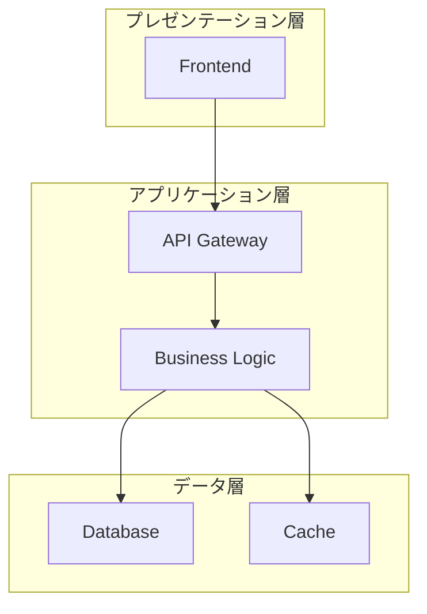
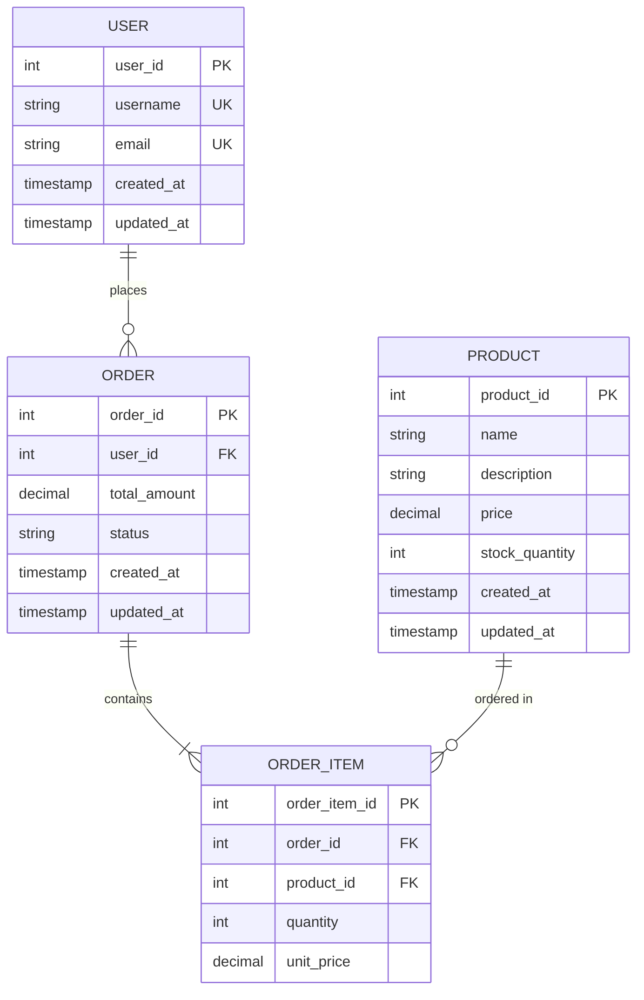
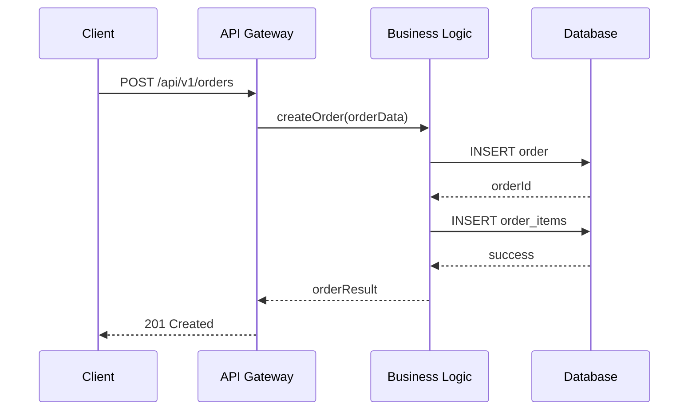
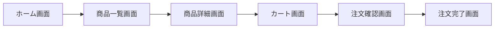
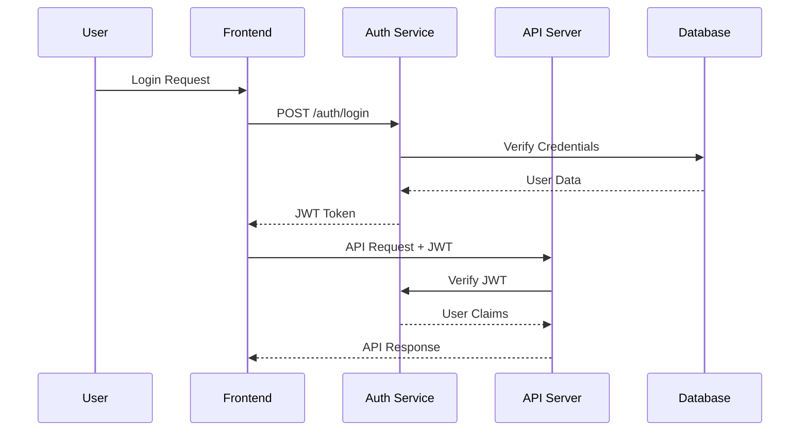

# 詳細設計書

## メタデータ
- **プロジェクトID**: ${PROJECT_ID}
- **ドキュメントID**: DES-${TIMESTAMP}
- **作成日**: ${DATE}
- **最終更新日**: ${UPDATE_DATE}
- **フェーズ**: 詳細設計
- **ステータス**: 作成中 / レビュー中 / 承認済み / 実装中 / 完了
- **要件定義参照**: [REQ-${REQ_TIMESTAMP}](./requirements.md)

## システム概要
### アーキテクチャ概要
[システムの全体アーキテクチャを記述]

### 技術スタック
- **フロントエンド**: [使用技術]
- **バックエンド**: [使用技術]
- **データベース**: [使用技術]
- **インフラストラクチャ**: [使用技術]

## システムアーキテクチャ

### [DES-A001] 全体アーキテクチャ
**要件参照**: [REQ-F001](./requirements.md#req-f001)



**説明**:
- [各コンポーネントの説明]
- [データフローの説明]
- [セキュリティ要件との関連]

**AI実行手順**:
```
1. プレゼンテーション層の実装
   - component_type: "frontend"
   - framework: "${FRONTEND_FRAMEWORK}"
   - entry_point: "src/main.${EXT}"

2. API層の実装
   - component_type: "api"
   - framework: "${BACKEND_FRAMEWORK}"
   - endpoint_pattern: "/${VERSION}/api/${RESOURCE}"

3. データ層の実装
   - component_type: "database"
   - schema: "database/schema.sql"
   - migration: "database/migrations/"
```

## データベース設計

### [DES-D001] エンティティ関係図
**要件参照**: [REQ-F001](./requirements.md#req-f001)



**テーブル定義**:
- **USER**: ユーザー情報管理
- **ORDER**: 注文情報管理
- **PRODUCT**: 商品情報管理
- **ORDER_ITEM**: 注文明細管理

**AI実行手順**:
```
1. スキーマ生成
   - action: "create_schema"
   - tables: ["user", "order", "product", "order_item"]
   - constraints: "foreign_key_cascades"

2. インデックス作成
   - action: "create_indexes"
   - performance_critical_queries: ["user_orders", "product_search"]

3. 初期データ投入
   - action: "seed_data"
   - test_data: "database/seeds/"
```

## API設計

### [DES-API001] RESTful API設計
**要件参照**: [REQ-F001](./requirements.md#req-f001)



**エンドポイント定義**:

#### 注文作成API
- **エンドポイント**: `POST /api/v1/orders`
- **リクエスト**:
  ```json
  {
    "user_id": 1,
    "items": [
      {
        "product_id": 1,
        "quantity": 2
      }
    ]
  }
  ```
- **レスポンス**:
  ```json
  {
    "order_id": 123,
    "total_amount": 2000,
    "status": "created",
    "created_at": "2024-01-01T00:00:00Z"
  }
  ```

**AI実行手順**:
```
1. APIルーティング実装
   - action: "create_routes"
   - pattern: "REST"
   - versioning: "url_versioning"

2. バリデーション実装
   - action: "implement_validation"
   - schema_validation: "request/response"

3. エラーハンドリング
   - action: "implement_error_handling"
   - error_codes: "HTTP_standard"
```

## UI/UX設計

### [DES-UI001] 画面設計
**要件参照**: [REQ-F001](./requirements.md#req-f001)



**画面詳細**:
- **ホーム画面**: [画面の説明とワイヤーフレーム]
- **商品一覧画面**: [画面の説明とワイヤーフレーム]
- **商品詳細画面**: [画面の説明とワイヤーフレーム]

**AI実行手順**:
```
1. コンポーネント作成
   - action: "create_components"
   - component_library: "${UI_LIBRARY}"
   - responsive: "mobile_first"

2. 状態管理実装
   - action: "implement_state"
   - pattern: "flux/redux"

3. ルーティング設定
   - action: "setup_routing"
   - router: "${ROUTER_LIBRARY}"
```

## セキュリティ設計

### [DES-SEC001] 認証・認可設計
**要件参照**: [REQ-NF002](./requirements.md#req-nf002)



**セキュリティ要件**:
- JWT認証による状態管理
- RBAC（Role-Based Access Control）
- HTTPS通信の強制
- SQLインジェクション対策
- XSS対策

**AI実行手順**:
```
1. 認証システム実装
   - action: "implement_auth"
   - method: "JWT"
   - expiry: "24_hours"

2. 認可システム実装
   - action: "implement_authorization"
   - pattern: "RBAC"

3. セキュリティミドルウェア
   - action: "implement_middleware"
   - security_headers: "OWASP_recommended"
```

## パフォーマンス設計

### [DES-PERF001] パフォーマンス要件実装
**要件参照**: [REQ-NF001](./requirements.md#req-nf001)

**最適化戦略**:
- データベースインデックス最適化
- キャッシュ戦略
- CDN活用
- 画像最適化

**AI実行手順**:
```
1. キャッシュ実装
   - action: "implement_cache"
   - cache_type: "Redis"
   - strategy: "write_through"

2. データベース最適化
   - action: "optimize_queries"
   - indexing: "automatic"
   - query_analysis: "enabled"
```

## 変更管理

### 設計変更履歴
| 日付 | バージョン | 変更内容 | 影響範囲 | 変更者 |
|------|-----------|----------|----------|-------|
| ${DATE} | 1.0 | 初版作成 | - | Claude |

### 要件への影響
設計変更時は以下を確認：
- [ ] 要件定義への影響確認
- [ ] 関連設計項目への影響確認
- [ ] テスト項目への影響確認

## 実装ガイドライン

### コーディング規約
- [プロジェクト固有のコーディング規約]

### テスト戦略
- [テスト方針とテスト種別]

### デプロイ戦略
- [デプロイフローと環境]

---
**注記**: このテンプレートは設計ドリブン開発ワークフローの一部として生成されています。
設計の変更は要件定義との整合性を保って実施してください。